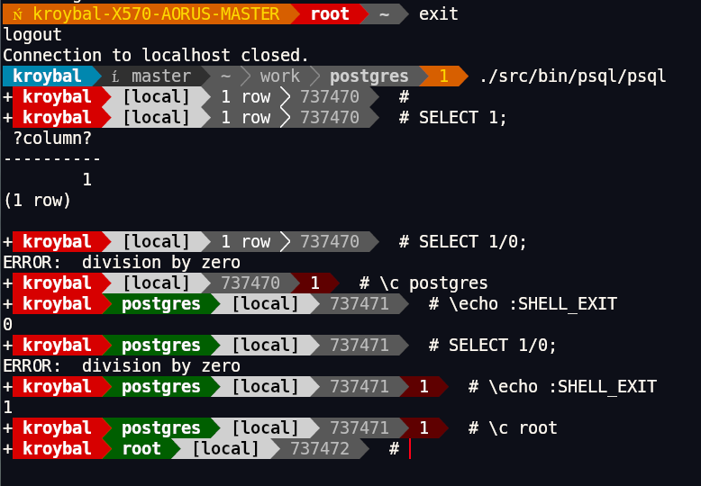

# psql prompt extensions and Powerline integration

This document describes optional prompt features added for dynamic prompt
generation (similar in spirit to bash `PROMPT_COMMAND`) and their companion
implementation in the [powerline](https://github.com/powerline/powerline) project.

## Testing

Automated coverage lives in `src/bin/psql/t/040_prompt_command.pl` (TAP):

- `SHELL_EXIT` after SQL success/failure and `\!`
- `\connect` reset of `ROW_COUNT` / `SHELL_EXIT`
- Interactive `PROMPT_COMMAND` + `%D`, first-line capture, unset behavior
- `PROMPT_SESSION_EXPORT` on/off gating of `PSQL_*` export
- Confirm `PROMPT_COMMAND` does not overwrite `SHELL_EXIT`

## Backward compatibility

All behavior is **opt-in**.  With no `.psqlrc` changes, psql behaves as before
except for the addition of new psql variables (`SHELL_EXIT`, `PROMPT_COMMAND`,
`PROMPT_SESSION_EXPORT`, and the `%D` prompt escape) that have no effect until
configured.

| Switch | Default | Purpose |
|--------|---------|---------|
| `PROMPT_COMMAND` | unset | Run a shell command before each interactive prompt; first line of stdout is inserted via `%D` |
| `PROMPT_SESSION_EXPORT` | off | When on, export `PG*` / `PSQL_*` environment for `PROMPT_COMMAND` subprocesses |
| `%D` in `PROMPT1`/`PROMPT2` | unused | Substitute `PROMPT_COMMAND` output (only when `PROMPT_COMMAND` is set) |

`PROMPT_SESSION_EXPORT` exists so maintainers can keep session export separate
from `PROMPT_COMMAND` itself: users who only need `%D` without polluting the
subprocess environment leave it off.

## PostgreSQL side (this tree)

- `PROMPT_COMMAND` — shell command before each prompt (like bash)
- `%D` — insert first line of `PROMPT_COMMAND` stdout into `PROMPT1`/`PROMPT2`
- `SHELL_EXIT` — exit status of the last SQL or shell command (for prompt themes)
- `PROMPT_SESSION_EXPORT` — gate for exporting session state to the subprocess
- Exported when `PROMPT_SESSION_EXPORT` is on: `PGDATABASE`, `PGUSER`, `PGHOST`,
  `PGPORT`, `PSQL_SHELL_EXIT`, `PSQL_TXN`, `PSQL_ROW_COUNT`, `PSQL_TXID` (if
  the `txid` variable is set), `PSQL_SUPERUSER`

## Powerline side (companion patch)

A matching **psql extension** is prepared for submission to powerline:

- Repository: https://github.com/powerline/powerline
- Extension: `psql` (`powerline-render psql left`)
- Segments: user (with PostgreSQL superuser highlighting), database, host,
  port, transaction, row count, txid, last exit status
- Renderer: readline non-printing markers (`\x01`/`\x02`)

See powerline’s `docs/source/usage/psql-postgres-integration.rst` (added in the
companion patch) for `.psqlrc` configuration.

## Example (screenshot)

End-to-end session with both patches and the sample `.psqlrc` below (built
`psql`, powerline `psql` extension, local PostgreSQL):



Visible behavior in the screenshot:

- **Red user segment** — PostgreSQL superuser (`PSQL_SUPERUSER=1`), not the
  Unix account name
- **Green database segment** — appears after `\c postgres` / `\c root` when the
  database name differs from the user
- **Red exit-status segment** — after `SELECT 1/0`
- **txid segment** — increments on `\c` (optional `SELECT txid_current() AS txid \gset` at connect)
- **`SHELL_EXIT`** — `\echo :SHELL_EXIT` returns `0` after a successful connect

## Example `.psqlrc` (requires both patches)

```sql
\set PROMPT_SESSION_EXPORT on
\set PROMPT_COMMAND 'powerline-render psql left --last-exit-code ${PSQL_SHELL_EXIT:-0} -w ${COLUMNS:-120} 2>/dev/null'
\set PROMPT1 '%D %x%# '
\set PROMPT2 '%w%R%x%# '
```

Optional: snapshot transaction id at connect for the txid segment:

```sql
SELECT txid_current() AS txid \gset
```

## Deployment note

Neither patch depends on the other at build time.  Full functionality appears
when both are deployed and the user enables the variables above.  Either
project can merge independently; cross-references in code and docs point to
the companion implementation.